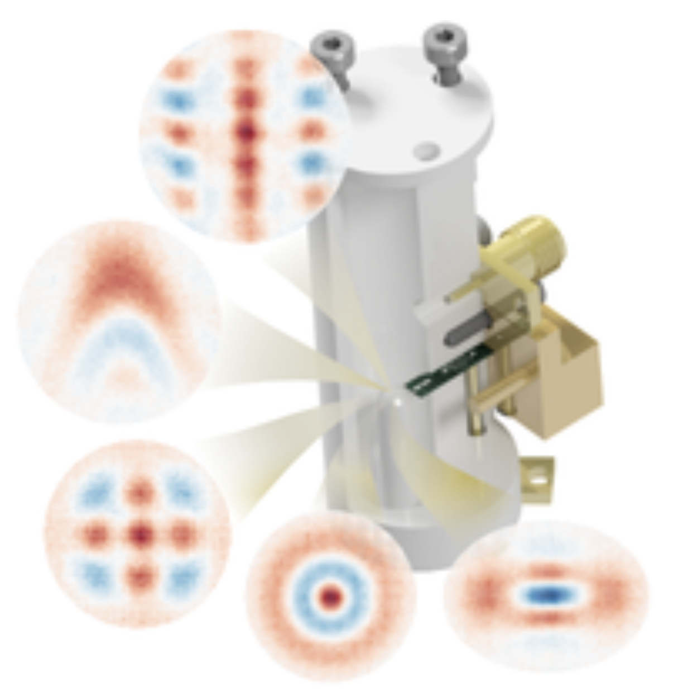

# snap

### Robust Preparation of Wigner-Negative States with Optimized SNAP-Displacement Sequences
>> Marina Kudra, Mikael Kervinen, Ingrid Strandberg, Shahnawaz Ahmed, Marco Scigliuzzo, Amr Osman, Daniel Pérez Lozano, Mats O. Tholén, Riccardo Borgani, David B. Haviland, Giulia Ferrini, Jonas Bylander, Anton Frisk Kockum, Fernando Quijandría, Per Delsing, and Simone Gasparinetti
PRX Quantum 3, 030301 – Published 1 July 2022
Link: https://journals.aps.org/prxquantum/abstract/10.1103/PRXQuantum.3.030301

In this repository, we will provide the code and data to generate some of the results that we show in our work
on using SNAP gates to create Wigner negative states in a 3D cavity including a GKP state as well as a Cubic Phase state.

In the notebooks folder, you will find Jupyter notebooks that demonstrate the following:
 - Optimizing SNAP gates: We use a simple gradient-descent approach to obtain the SNAP gate parameters which uses the JAX autodifferentiation library. 

# Contact

Please contact shahnawaz.ahmed95@gmail.com for questions regarding the code and implementations.
